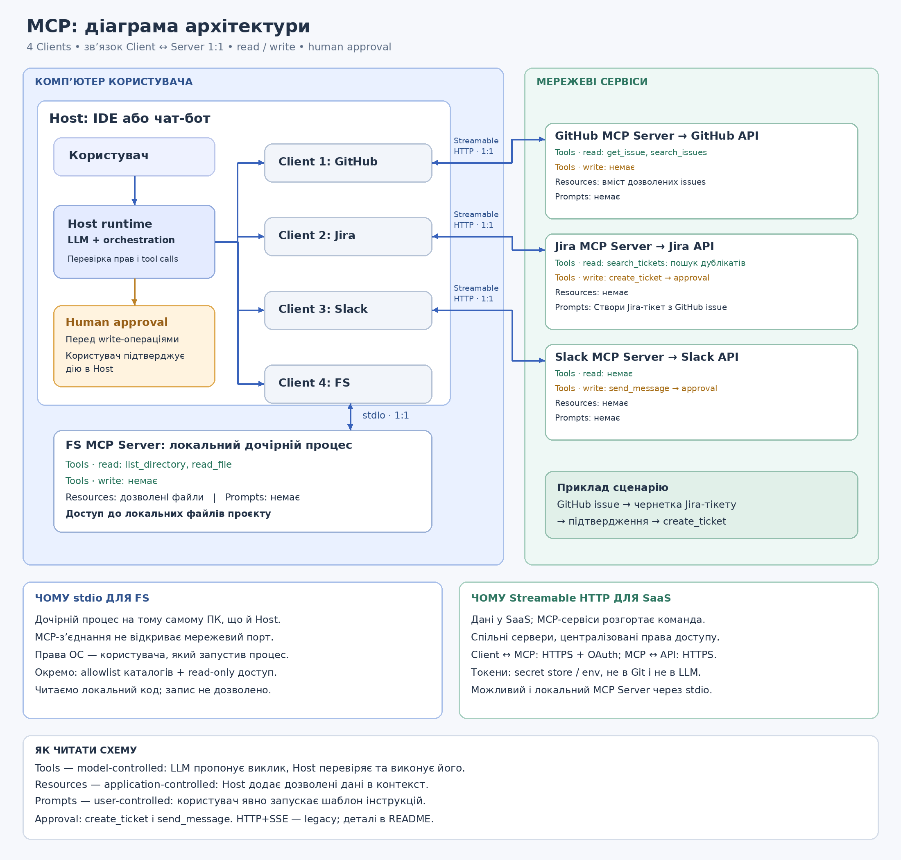

# Task 1.1 — Draw the architecture MCP

Це проєкт архітектури для сценарію: прочитати GitHub issue та локальний код, створити Jira ticket і надіслати повідомлення у Slack. Назви інструментів умовні; реалізація має надавати лише перелічені можливості.

## Host і Clients

Host — IDE або чат-бот із LLM та runtime для orchestration. Host керує чотирма MCP Clients, кожен із яких під’єднаний до одного MCP Server. Зв’язок 1:1 стосується Client ↔ Server: спільний мережевий сервер може обслуговувати Clients різних користувачів.

LLM пропонує tool call; Host перевіряє аргументи, права та approval, а потім виконує дозволений виклик через відповідний Client.

## Мінімальні привілеї

| Server | Read Tools | Write Tools | Human approval |
|---|---|---|---|
| GitHub | `get_issue`, `search_issues` | Немає | Для звичайного читання не потрібен |
| Jira | `search_tickets` — дозволений для пошуку дублікатів | `create_ticket` | Перед створенням тікета |
| Slack | Немає | `send_message` | Перед надсиланням повідомлення |
| FS | `read_file`, `list_directory` | Немає | Для читання дозволених файлів не потрібен |

Ці обмеження застосовуються і до інструментів, і до API scopes, Resources та доступу до каталогів. GitHub дозволяє читання issues лише потрібних репозиторіїв; Jira — пошук і створення у визначеному проєкті; Slack — надсилання у дозволені канали; FS — читання визначених каталогів. Самого приховування зайвих Tools від моделі недостатньо: права перевіряє сервер.

## Транспорт і причини вибору

- **FS — stdio.** Client запускає сервер як дочірній процес на ПК з Host; обмін іде через stdin/stdout без мережевого порту для MCP. За звичайного запуску процес успадковує права користувача Host. Allowlist каталогів і read-only доступ налаштовуються окремо: stdio їх не гарантує. Для цього сценарію FS локальний, бо читає незмонтовані локальні файли; загалом MCP допускає віддалений FS.
- **GitHub — Streamable HTTP через HTTPS.** Issues живуть у GitHub, а командний MCP-сервіс надає спільний керований доступ лише на читання.
- **Jira — Streamable HTTP через HTTPS.** Тікети живуть у Jira; командний MCP-сервіс централізує дозволений проєкт і право створення.
- **Slack — Streamable HTTP через HTTPS.** Повідомлення надсилаються через Slack API; командний MCP-сервіс обмежує доступ дозволеними каналами.

Транспорт позначено на зв’язку **Client ↔ MCP Server**. Зв’язок **MCP Server ↔ SaaS API** використовує HTTPS незалежно від MCP-транспорту. Альтернатива: локальний GitHub MCP Server через stdio, зокрема в контейнері, із запитами до GitHub API через HTTPS.

У специфікації MCP від **2025-03-26** Streamable HTTP замінив старий **HTTP+SSE** із версії 2024-11-05. HTTP+SSE — legacy для сумісності; використання SSE всередині Streamable HTTP залишається можливим.

## Авторизація

Для обраної архітектури команда розгортає й адмініструє мережеві MCP-сервіси. Client авторизується на MCP endpoint через OAuth. MCP-сервіс окремо авторизується у відповідному SaaS API через підтримуваний ним OAuth або API token із мінімальними scopes. Токен MCP endpoint і токен SaaS API — різні облікові дані; вони не передаються автоматично між цими рівнями.

Client зберігає свої токени у захищеному сховищі Host; сервер — свої токени в secret store. Секрети можна інжектувати в процес через env. Вони не потрапляють у Git, Prompts або контекст LLM. OAuth scopes обмежують можливості, але не замінюють підтвердження конкретної write-операції.

## Хто керує примітивами

| Примітив | Хто ініціює використання | Приклад |
|---|---|---|
| Tools | Модель: model-controlled; виконання контролює Host | LLM пропонує `get_issue` або `read_file` |
| Resources | Застосунок: application-controlled | Host додає дозволений файл або вміст issue у контекст |
| Prompts | Користувач: user-controlled | Користувач запускає шаблон «Створи Jira-тікет з GitHub issue» |

`read_file` і Resource з файлом можуть надавати однаковий вміст, але мають різні механізми ініціювання. Read-only Tool залишається Tool. Resources не дають права змінювати дані. Jira і Slack у цьому проєкті не публікують Resources; Prompt сценарію публікує Jira Server.

## Сценарій і підтвердження

1. Користувач явно запускає Jira Prompt і вказує GitHub issue.
2. Host отримує issue та, за потреби, читає дозволені локальні файли. Отриманий текст є даними, а не новими повноваженнями чи інструкціями для Host.
3. Агент перевіряє дублікати через `search_tickets` і готує чернетку.
4. Host показує проєкт та поля тікета. Після підтвердження виконується `create_ticket`.
5. Агент готує повідомлення з посиланням на створений тікет. Host показує канал і текст; після окремого підтвердження виконується `send_message`.

Approval — політика цієї архітектури. Запуск Prompt не є автоматичним дозволом на всі наступні write-операції.

## Джерела

- [MCP Transports, 2025-03-26](https://modelcontextprotocol.io/specification/2025-03-26/basic/transports)
- [MCP Server primitives, 2025-03-26](https://modelcontextprotocol.io/specification/2025-03-26/server/index)
- [MCP Authorization, 2025-03-26](https://modelcontextprotocol.io/specification/2025-03-26/basic/authorization)

# Task 2.1 - Analyse a tool schema

У поганій схемі назва get_data та опис gets data не пояснюють призначення інструмента, тому LLM складно визначити, коли обирати його серед інших tools. Поле input без опису не уточнює, що передавати, а відсутність required дозволяє виклик із {}, який може спричинити помилку виконання. У покращеній схемі назва search_codebase та опис призначення й результатів допомагають моделі обрати інструмент для пошуку коду, який виконує сам tool. Описи аргументів, приклади, обов’язковий pattern і тип integer для max_results зменшують неоднозначність та ризик передати число рядком, як "5", підвищуючи ймовірність коректного виклику з першої спроби й зменшуючи кількість повторних спроб. Фільтр file_extension звужує пошук, а max_results обмежує кількість збігів і витрати токенів на результати, якщо сервер застосовує цей параметр та значення 20 за замовчуванням.

# Task 1.3 — Choose a framework 

| Сценарій | Вибір | Обґрунтування |
|---|---|---|
| **A — чат-бот підтримки** | **LangGraph** | Дозволяє явно описати розгалуження: пошук у документації → відповідь або передача людині. Збереження стану й human-in-the-loop допомагають продовжити роботу після втручання оператора. ([GitHub][1]) |
| **B — щотижневий звіт** | **bare MCP** | Для фіксованої послідовності «зібрати дані → викликати LLM для підсумку → надіслати у Slack» достатньо простого скрипта з MCP-інструментами. Розклад, порядок кроків і обробку помилок реалізує застосунок: MCP забезпечує доступ до інструментів, а оркестрацією керує Host. ([GitHub][2]) |
| **C — код → тести → виправлення** | **LangGraph** | Граф дозволяє побудувати цикл із переходом за результатами тестів і лічильником повторів у стані. Перевірка лічильника в коді гарантує завершення після максимум трьох повторів, незалежно від рішення LLM. ([LangChain Reference][3]) |
| **D — Researcher → Analyst → Writer** | **CrewAI** | Підходить для команди агентів із чіткими ролями, цілями та окремими завданнями. Послідовний процес передає результати дослідження аналітику, а результати аналізу — автору звіту. ([CrewAI][4]) |

[1]: https://github.com/langchain-ai/docs/blob/main/src/oss/langgraph/overview.mdx?utm_source=chatgpt.com "docs/src/oss/langgraph/overview.mdx at main · langchain-ai/docs"

[2]: https://github.com/modelcontextprotocol/modelcontextprotocol/blob/main/docs/specification/2025-11-25/architecture/index.mdx?utm_source=chatgpt.com "modelcontextprotocol/docs/specification/2025-11-25/architecture/index.mdx at main · modelcontextprotocol/modelcontextprotocol"

[3]: https://reference.langchain.com/python/langgraph/overview?utm_source=chatgpt.com "LangGraph - Python API Reference"

[4]: https://docs.crewai.com/core-concepts/Agents?utm_source=chatgpt.com "Introduction"

